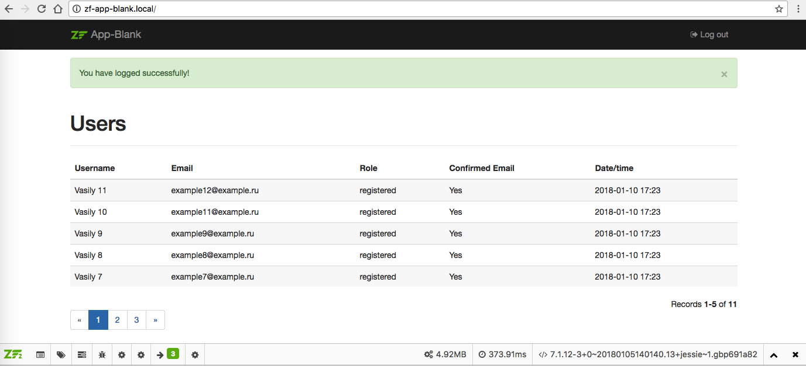

zf-app-blank
============

[](https://packagist.org/packages/bupy7/zf-app-blank)
[](https://packagist.org/packages/bupy7/zf-app-blank)
[](https://packagist.org/packages/bupy7/zf-app-blank)

Autoloading standart [PSR-4](http://www.php-fig.org/psr/psr-4/). Coding standart [PSR-2](http://www.php-fig.org/psr/psr-2/).



TODO
----

- Refactoring code to PHP 7.1.
- Add PHP tests.

Features
--------

- PHP7.1
- [Zend Framework 3](https://github.com/zendframework/zendframework)
- [Bootstrap 3](http://getbootstrap.com/)
- [Doctrine ORM 2](http://www.doctrine-project.org/)
- [Debug Bar](https://github.com/snapshotpl/ZfSnapPhpDebugBar)
- [Twig](http://twig.sensiolabs.org/)
- [Assetic Management](https://github.com/kriswallsmith/assetic)
- [RBAC](https://github.com/ZF-Commons/zfc-rbac)
- [Flexible Form Builder](https://github.com/bupy7/zf-form)
- [Support Vagrant](https://www.vagrantup.com/)
- [Support Composer](https://getcomposer.org/)
- [Support Asset Packagist](https://asset-packagist.org/)
- [Database is PostgreSQL](https://www.postgresql.org/)
- [Database is MySQL](https://www.mysql.com/)
- [YUI Comressor](https://github.com/yui/yuicompressor)
- [UglifyJS2](https://github.com/mishoo/UglifyJS2)
- [PHP Coding Standarts Fixer](https://github.com/FriendsOfPHP/PHP-CS-Fixer)
- [XDebug](https://xdebug.org/)
- [Mailgun](https://www.mailgun.com/)
- Multilanguage (English and Russian).
- Simple example application: (Sign in, Sign up, Log out, Confirm Email address, Recovery password).

Installation
------------

- Download and unpack the repository.

- [Install Vagrant](https://www.vagrantup.com/docs/installation/)

- Install plugins for Vagrant:

```
$ vagrant plugin install vagrant-vbguest
$ vagrant plugin install vagrant-hostmanager
```

- Run install the work environment:

```
$ vagrant up
```

- Paste GitHub token in `/workenv/config/vagrant-local.yml`

- Run again:

```
$ vagrant up
```

- Configure Mailgun in `/config/autoload/local.php`:
 
You should [create Mailgun account](https://www.mailgun.com/) if you didn't do it before.
Also, create [Postbin](http://bin.mailgun.net/).
 
```php
'mailgun' => [
    'key' => 'key-somekey',
    'endpoint' => 'http://bin.mailgun.net/somekey',
],
'mail' => [
    'domain' => 'somesudomain.mailgun.org',
],
```

- Create scheme:

```
$ vagrant ssh -c 'php bin/console orm:schema-tool:create'
$ vagrant ssh -c 'php bin/console-test orm:schema-tool:create'
```

- Done.

Testing
-------

Run tests:

```
$ vagrant ssh -c 'composer test:build'
$ vagrant ssh -c 'composer test'
```

License
-------

zf-app-blank is released under the BSD 3-Clause License.
